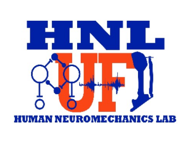

<!-- Improved compatibility of back to top link: See: https://github.com/othneildrew/Best-README-Template/pull/73 -->
<link rel="stylesheet" type="text/css" href="styles.css" />

<!--
*** Thanks for checking out the Best-README-Template. If you have a suggestion
*** that would make this better, please fork the repo and create a pull request
*** or simply open an issue with the tag "enhancement".
*** Don't forget to give the project a star!
*** Thanks again! Now go create something AMAZING! :D
-->

<!-- PROJECT SHIELDS -->
<!--
*** I'm using markdown "reference style" links for readability.
*** Reference links are enclosed in brackets [ ] instead of parentheses ( ).
*** See the bottom of this document for the declaration of the reference variables
*** for contributors-url, forks-url, etc. This is an optional, concise syntax you may use.
*** https://www.markdownguide.org/basic-syntax/#reference-style-links
-->
[![Contributors][contributors-shield]][contributors-url]
[![Forks][forks-shield]][forks-url]
[![Stargazers][stars-shield]][stars-url]
[![Issues][issues-shield]][issues-url]
[![MIT License][license-shield]][license-url]
[![LinkedIn][linkedin-shield]][linkedin-url]

<!-- PROJECT LOGO -->
 

  
<h3 align="center">(Mind In Motion) Younger vs Older Adults Electrocortical Dynamics with Walking Speed Changes</h3>

  

    Preferred and maximum walking speeds decline as we age and have been associated with worsening health. A body of evidence has shown biomechanical, sub-cortical, and some cortical contributions to slowing gait speed.  Additional studies observing older and younger adults’ whole brain dynamics during walking would provide insight into network wide contributions to slowing gait. We studied younger (N=31) and older adults (N=57) walking on a treadmill at different speeds (0.25, 0.50, 0.75, 1.0 m/s) while their electrocortical dynamics were recorded using high density electroencephalography EEG. We hypothesized  that sensorimotor and posterior parietal theta power would increase and beta power would decrease with increasing gait speed, consistent with previous studies of younger adults walking at different speeds. Additionally, we used a standardized test of physical function to group older adults. A Short Physical Performance Battery (SPPB)  categorized older adults into high (SPPB>=10) and low (SPPB<10) function groups.  Then we compared EEG power modulations across age and physical function. In agreement with our hypotheses, sensorimotor and posterior parietal theta power increased, and beta power decreased with increasing gait speed. Additionally, we observed differences in power modulations between younger and older adults in sensorimotor, posterior parietal, mid cingulate, left supplementary motor, and right temporal. Our results show that regulation of gait speed activates a network of brain areas that are thought to be involved in error detection and sensorimotor processing.   Further, there are differences in electrocortical contributions between younger and older adults while walking at different speeds, and mobility status may play a role in the degree of these contributions.
     
    <a href="https://github.com/JacobSal/MindInMotion_YoungerOlderAdults_BrainSpeedChanges/issues">Report Bug</a>
    ·
    <a href="https://github.com/JacobSal/MindInMotion_YoungerOlderAdults_BrainSpeedChanges/issues">Request Feature</a>
  

<!-- TABLE OF CONTENTS -->

  
Table of Contents

  <ol>
    <li>
      <a href="#about-the-project">About The Project</a>
      <ul>
        <li><a href="#built-with">Built With</a></li>
      </ul>
    </li>
    <li>
      <a href="#getting-started">Getting Started</a>
      <ul>
        <li><a href="#prerequisites">Prerequisites</a></li>
        <li><a href="#installation">Installation</a></li>
      </ul>
    </li>
    <li><a href="#usage">Usage</a></li>
    <li><a href="#contributing">Contributing</a></li>
    <li><a href="#license">License</a></li>
    <li><a href="#contact">Contact</a></li>
    <li><a href="#acknowledgments">Acknowledgments</a></li>
  </ol>

<!-- ABOUT THE PROJECT -->
## About The Project

Understanding the neural control of regulating gait speed in older and younger adults can elucidate the neural mechanism of mobility decline that occurs during aging. Keywords: Aging, Biomechanics, Clinical, Electroencephalography, Neuroscience

### Funding

This study was supported by the National Institute of Health (U01AG061389) for authors JSS, CL, EMP, MT, AR, NR, JH, CJH, DJC, RDS, TMM, YCA, and DPF. National Institute of Health grants F32AG072808 and T32AG062728 supported author EMP. American Heart Association Fellowship (23POST1011634, doi.org/10.58275/AHA.23POST1011634.pc.gr.161292) partially supported author CL. DPF was also supported by National Institutes of Health (R01NS104772). The funders had no role in study design, data collection and analysis, decision to publish, or preparation of the manuscript.

(<a href="#readme-top">back to top</a>)

### Built With
| MATLAB | EEGLAB | FIELDTRIP | SPM 12 |
| ------ | ------ | --------- | ------ |
|  |  |  |  |

<!--| [![matlab][matlab-badge]][matlab-url] | [![eeglab][eeglab-badge]][eeglab-url] | FieldTrip [![fieldtrip][fieldtrip-badge]][fieldtrip-url] | [![spm][spm-badge]][spm-url] | -->

<!-- |  |  |  |  |
-->

Additional Packages: BCILAB, bemobil-pipeline, bids-matlab-tools, bva-io, clean rawdata, cleanline, dipfit, EEGLAB-specparam, firfilt, iCanClean, ICLabel, limo_tools, postAmicaUtility, PowPowCAT, trimOutlier, viewprops, Gait-Tracking-With-x-IMU

(<a href="#readme-top">back to top</a>)

<!-- GETTING STARTED -->
## Getting Started
This repository has links to the desired submodules embedded with in it. --recurse-submodules will grab necessary dependencies and install them for you. We also include some functions are overriden within the respective packages in ./src/_functions . 

### Prerequisites
MATLAB 2023b

### Installation
git  clone https://github.com/JacobSal/MindInMotion_YoungerOlderAdults_BrainSpeedChanges --recurse-submodules

(<a href="#readme-top">back to top</a>)

<!-- USAGE EXAMPLES -->
## Usage

This code is intended for use with high-density EEG data. The code is not guaranteed to work for all EEG data, collection procedures, or analysis goals. This code does include scripts and functions that may inspire and  guide your own analysis. The code is not intended to be a comprehensive or definitive analysis of the data. 

(<a href="#readme-top">back to top</a>)

<!-- CONTRIBUTING -->
## Contributing

Contributions are what make the open source community such an amazing place to learn, inspire, and create. Any contributions you make are **greatly appreciated**.

If you have a suggestion that would make this better, please fork the repo and create a pull request. You can also simply open an issue with the tag "enhancement".
Don't forget to give the project a star! Thanks again!

1. Fork the Project
2. Create your Feature Branch (`git checkout -b feature/AmazingFeature`)
3. Commit your Changes (`git commit -m 'Add some AmazingFeature'`)
4. Push to the Branch (`git push origin feature/AmazingFeature`)
5. Open a Pull Request

(<a href="#readme-top">back to top</a>)

<!-- LICENSE -->
## License

Distributed under the MIT License. See `LICENSE.txt` for more information.

(<a href="#readme-top">back to top</a>)

<!-- CONTACT -->
## Contact

Corresponding Author: Jacob Salminen, jsalminen14@gmail.com

Project Link: [https://github.com/JacobSal/MindInMotion_YoungerOlderAdults_BrainSpeedChanges](https://github.com/JacobSal/MindInMotion_YoungerOlderAdults_BrainSpeedChanges)

(<a href="#readme-top">back to top</a>)

<!-- ACKNOWLEDGMENTS -->
## Acknowledgments

Thank you to Chang Liu Ph.D., Ryan Downey Ph.D., and the members of HNL lab for contributing and identifying bugs in this code. Thank you to the creators of the supporting packages of this repository as well.

We would like to thank HNL lab members for their help with data collection: Ryland Swearinger, Ryan J Downey, Quinlan Degnan, Sydney Irwin, and we thank the HNL members for their feedback and intellectual support to improve the paper. We would also like to thank our study coordinators for their devotion to project goals even during Covid-19 pandemic.

(<a href="#readme-top">back to top</a>)

<!-- MARKDOWN LINKS & IMAGES -->
<!-- https://www.markdownguide.org/basic-syntax/#reference-style-links -->
[contributors-shield]: https://img.shields.io/github/contributors/JacobSal/MindInMotion_YoungerOlderAdults_BrainSpeedChanges.svg?style=for-the-badge
[contributors-url]: https://github.com/JacobSal/MindInMotion_YoungerOlderAdults_BrainSpeedChanges/graphs/contributors
[forks-shield]: https://img.shields.io/github/forks/JacobSal/MindInMotion_YoungerOlderAdults_BrainSpeedChanges.svg?style=for-the-badge
[forks-url]: https://github.com/JacobSal/MindInMotion_YoungerOlderAdults_BrainSpeedChanges/network/members
[stars-shield]: https://img.shields.io/github/stars/JacobSal/MindInMotion_YoungerOlderAdults_BrainSpeedChanges.svg?style=for-the-badge
[stars-url]: https://github.com/JacobSal/MindInMotion_YoungerOlderAdults_BrainSpeedChanges/stargazers
[issues-shield]: https://img.shields.io/github/issues/JacobSal/MindInMotion_YoungerOlderAdults_BrainSpeedChanges.svg?style=for-the-badge
[issues-url]: https://github.com/JacobSal/MindInMotion_YoungerOlderAdults_BrainSpeedChanges/issues
[license-shield]: https://img.shields.io/github/license/JacobSal/MindInMotion_YoungerOlderAdults_BrainSpeedChanges.svg?style=for-the-badge
[license-url]: https://github.com/JacobSal/MindInMotion_YoungerOlderAdults_BrainSpeedChanges/blob/master/LICENSE.txt
[linkedin-shield]: https://img.shields.io/badge/-LinkedIn-black.svg?style=for-the-badge&logo=linkedin&colorB=555
[linkedin-url]: https://linkedin.com/in/jacob-salminen-124a50129
[matlab-badge]: ./images/matlab_logo.png
[matlab-url]: https://www.mathworks.com/products/matlab.html?style=for-the-badge
[eeglab-badge]: ./images/eeglab_logo.svg
[eeglab-url]: https://eeglab.org/#The_EEGLAB_Tutorial_Outline
[fieldtrip-badge]: ./images/fieldtrip_logo.png
[fieldtrip-url]: https://www.fieldtriptoolbox.org/
[spm-badge]: https://avatars.githubusercontent.com/u/14014701?s=200&v=4?style=for-the-badge
[spm-url]: https://github.com/spm/
[product-screenshot]: images/screenshot.png
